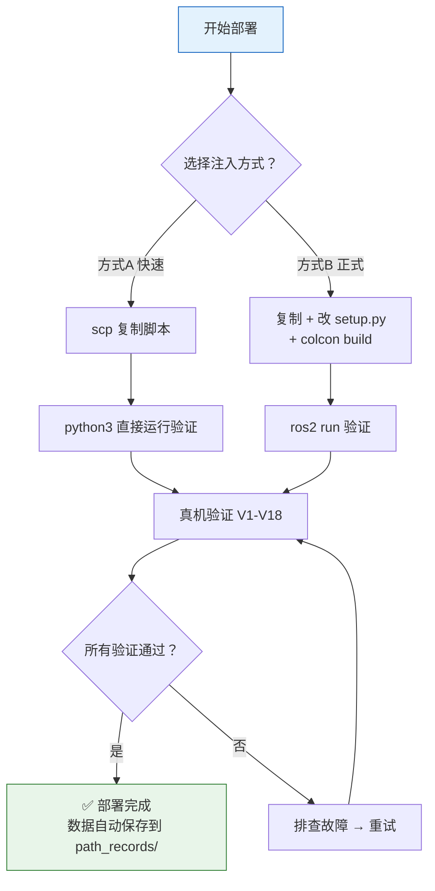

# SOP：plan_listener.py 注入与真机验证

## 文档信息

| 项目 | 内容 |
|------|------|
| SOP 编号 | SOP-20260607-001 |
| 脚本名称 | plan_listener.py |
| 用途 | 监听 `/plan` `/goal_pose` `/initialpose` 话题，实时输出 Nav2 规划器路径分析，**明文保存每次路径为 CSV 文件** |
| 依赖文件 | `plan_listener.py` |
| 目标系统 | davinci-mini@192.168.5.100 / ROS2 Humble / Ubuntu 22.04 ARM64 |
| 编制日期 | 2026-06-07 |
| 版本 | v2.0（新增明文保存功能） |

---

## 目录

1. [前置条件检查](#1-前置条件检查)
2. [脚本功能概览](#2-脚本功能概览)
3. [保存的文件格式说明](#3-保存的文件格式说明)
4. [注入方式 A：直接复制（快速）](#4-注入方式-a直接复制快速)
5. [注入方式 B：注册为 ros2 run 命令（正式）](#5-注入方式-b注册为-ros2-run-命令正式)
6. [SSH 真机验证点](#6-ssh-真机验证点)
7. [联合测试（与 go.py 联调）](#7-联合测试与-gopy-联调)
8. [回滚方案](#8-回滚方案)
9. [安全注意事项](#9-安全注意事项)
10. [故障排查速查表](#10-故障排查速查表)

---

## 1. 前置条件检查

### 1.1 本地文件确认

在**本机（Windows）**确认以下文件存在且内容完整：

```bash
# 在本机执行
ls -la /c/Users/CX3/ClaudeWorkspace/047-小车比赛/scripts/plan_listener.py
# 预期输出：文件大小约 10-12KB，行数 ~370 行
```

### 1.2 SSH 连通性确认

```bash
# 在本机执行
ssh davinci-mini@192.168.5.100 "echo SSH_OK && ros2 --version && python3 --version"
# 预期输出：
#   SSH_OK
#   ros2 humble 版本号
#   Python 3.10.x
```

### 1.3 话题可用性确认

SSH 登入后，确认目标话题是否存在（需要先启动 `car.sh` 或 `nav.sh`）：

```bash
ssh davinci-mini@192.168.5.100

# 先启动 nav.sh（新终端或后台）
bash ~/racecar/nav.sh

# 另开 SSH 终端，确认话题存在
source ~/racecar/install/setup.bash
ros2 topic list | grep -E "/plan|/goal_pose|/initialpose"
# 预期输出（至少包含以下 3 个）：
#   /plan
#   /goal_pose
#   /initialpose
```

> ⚠️ **关键前提**：如果 `/plan` 话题不存在，说明 Nav2 的 `planner_server` 节点未启动或 bringup 配置异常。检查 `Run_nav.launch.py` 中 `lifecycle_nodes` 列表是否包含 `'planner_server'`。

### 1.4 依赖包确认

```bash
ssh davinci-mini@192.168.5.100
python3 -c "import rclpy; from nav_msgs.msg import Path; from geometry_msgs.msg import PoseStamped; print('All imports OK')"
# 预期输出：All imports OK
```

> 如果导入失败，说明缺少 ROS2 Python 依赖，需安装：
> ```bash
> sudo apt install ros-humble-nav-msgs ros-humble-geometry-msgs
> ```

### 1.5 磁盘空间确认

```bash
ssh davinci-mini@192.168.5.100
df -h ~/racecar/
# 确认可用空间 > 100MB（单条路径 CSV 约 10-50KB，100MB 可存上千条）
```

---

## 2. 脚本功能概览

### 2.1 监听的话题

| 话题 | 类型 | 用途 |
|------|------|------|
| `/plan` | `nav_msgs/Path` | 🗺️ Nav2 规划器输出的全局路径（**保存为 CSV**） |
| `/goal_pose` | `geometry_msgs/PoseStamped` | 🎯 go.py / RViz 发的导航目标（写入 CSV 元数据） |
| `/initialpose` | `geometry_msgs/PoseWithCovarianceStamped` | 📍 RViz 中设置的初始位姿（终端显示） |

### 2.2 运行参数

| 参数 | 默认值 | 说明 |
|------|--------|------|
| `--save-dir <路径>` | `~/racecar/path_records/` | 指定 CSV 保存目录 |
| `--no-save` | （不启用） | 不存文件，仅终端输出（兼容旧行为） |

### 2.3 启动示例

```bash
# 默认模式：打印 + 保存到 ~/racecar/path_records/
python3 ~/racecar/src/racecar/scripts/plan_listener.py

# 指定保存目录
python3 ~/racecar/src/racecar/scripts/plan_listener.py --save-dir ~/racecar/赛道3_路径记录

# 仅打印不保存
python3 ~/racecar/src/racecar/scripts/plan_listener.py --no-save
```

---

## 3. 保存的文件格式说明

### 3.1 文件位置

默认保存到 `~/racecar/path_records/`，目录不存在会自动创建。

### 3.2 文件命名

```
plan_<序号4位>_<时间戳>.csv

示例：
  plan_0001_20260607_143022.csv  （第1条路径）
  plan_0002_20260607_143105.csv  （第2条路径）
  plan_0003_20260607_143148.csv  （第3条路径）
```

### 3.3 文件内部结构（明文，可直接用 Excel / 记事本 / VS Code 打开）

```csv
# plan_listener 路径记录
# 生成时间: 2026-06-07 14:30:22
# 帧: map | 路径点数: 287 | 总长: 15.83m
# 起点: (1.9600, -0.2900) | 终点: (3.1268, -0.5585)
# 起点朝向: 175.3° | 终点朝向: 191.2°
# 曲折比: 13.53x | 弯曲度: 中等（含缓弯）
# 目标点: (3.1268, -0.5585) 朝向 176.2° (来自 /goal_pose 第2次)
#
# point_id, x, y, yaw_deg, segment_dist
0, 1.960000, -0.290000, 175.30, 0.000000
1, 2.049500, -0.254300, 176.20, 0.095431
2, 2.142800, -0.318700, 177.10, 0.106732
3, 2.235100, -0.383100, 178.00, 0.106732
...
286, 3.120000, -0.550000, 190.80, 0.015234
```

### 3.4 各列说明

| 列名 | 单位 | 说明 |
|:----:|:----:|:------|
| `point_id` | — | 路径点序号（从 0 开始） |
| `x` | 米 | 地图坐标系 X 坐标 |
| `y` | 米 | 地图坐标系 Y 坐标 |
| `yaw_deg` | 度 | 该点的朝向角（0~360°） |
| `segment_dist` | 米 | 该点到上一个点的距离（第 0 行为 0） |

### 3.5 元数据头说明（`#` 开头行）

| 行 | 说明 |
|:--:|------|
| `# 目标点` | 本次路径对应的导航目标（来自 /goal_pose） |
| `# 路径点数` | 路径包含的坐标点数量 |
| `# 总长` | 所有 segment_dist 之和（路径总长度） |
| `# 曲折比` | 路径长度 ÷ 起点到终点的直线距离（越大说明越绕路） |
| `# 弯曲度` | 自动评估的弯道程度描述 |

### 3.6 文件大小估算

| 路径点数 | 文件大小 | 示例场景 |
|:--------:|:--------:|---------|
| 50 点 | ~2 KB | 短距直行 |
| 200 点 | ~8 KB | 普通航段 |
| 500 点 | ~20 KB | 长距离跨场 |
| 1000 点 | ~40 KB | 全场大绕圈 |

> 跑一场完整比赛（~20 次路径规划）约产生 **200~400 KB** 数据，磁盘压力可忽略。

---

## 4. 注入方式 A：直接复制（快速）

> **适用场景**：临时调试、快速验证，不需要 `ros2 run` 注册。
> **优点**：无需修改任何现有文件，无需编译，即拷即用。
> **缺点**：只能用 `python3` 直接运行，不能 `ros2 run`。

### 4.1 步骤

```bash
# 在本机执行：将脚本复制到开发板
scp /c/Users/CX3/ClaudeWorkspace/047-小车比赛/scripts/plan_listener.py \
    davinci-mini@192.168.5.100:~/racecar/src/racecar/scripts/plan_listener.py

# SSH 登入确认
ssh davinci-mini@192.168.5.100
ls -la ~/racecar/src/racecar/scripts/plan_listener.py
# 预期输出：文件存在，权限 -rw-r--r--，大小约 10-12KB
```

### 4.2 临时运行方法

```bash
# 在开发板上执行（需要先有 nav.sh 在运行）
ssh davinci-mini@192.168.5.100
source ~/racecar/install/setup.bash
python3 ~/racecar/src/racecar/scripts/plan_listener.py

# 预期输出：
# ============================================================
# 🗺️  /plan 监听器已启动
#    订阅话题: /plan /goal_pose /initialpose
#    💾 保存目录: /home/davinci-mini/racecar/path_records/
#    配合 go.py / waypoint_cycle / RViz Nav Goal 使用
# ============================================================
```

### 4.3 ✅ 验证点 A1

```
☐ 文件已 scp 到开发板
☐ ls 确认文件存在且非空
☐ python3 直接运行无报错
☐ 控制台打印启动横幅（含保存目录）
```

---

## 5. 注入方式 B：注册为 `ros2 run` 命令（正式）

> **适用场景**：正式使用，纳入 racecar 包管理。
> **优点**：可以用 `ros2 run racecar plan_listener` 启动，与现有脚本统一。
> **缺点**：需要改 `setup.py` + `colcon build`。

### 5.1 修改 setup.py

```bash
ssh davinci-mini@192.168.5.100
nano ~/racecar/src/racecar/setup.py
```

找到 `entry_points` 节（如果没有则新建），添加 `plan_listener` 入口：

```python
entry_points={
    'console_scripts': [
        # ... 其他已有入口 ...
        'plan_listener = racecar.scripts.plan_listener:main',
    ],
},
```

> 📝 **注意**：`racecar.scripts.plan_listener:main` 中的 `main` 对应脚本末尾的 `main()` 函数。

### 5.2 编译

```bash
cd ~/racecar
colcon build --packages-select racecar
# 预期输出：Summary: 1 package finished
```

### 5.3 source 新环境

```bash
source ~/racecar/install/setup.bash

# 验证可执行文件已生成
ros2 run racecar plan_listener --help
# 预期输出：显示帮助信息（--save-dir, --no-save 等参数说明）

# 直接运行
ros2 run racecar plan_listener
# 预期输出：启动横幅
```

### 5.4 ✅ 验证点 B1

```
☐ setup.py 已添加 entry_point
☐ colcon build 编译成功（无 error）
☐ ros2 run racecar plan_listener 能正确启动
☐ ros2 run racecar plan_listener --help 显示帮助
☐ Ctrl+C 能正常退出（无僵尸进程）
```

---

## 6. SSH 真机验证点

### 6.1 话题订阅验证

确保 nav.sh 已启动，运行监听器后确认它能收到数据：

```bash
# SSH 终端 1：启动 nav.sh
bash ~/racecar/nav.sh

# SSH 终端 2：启动监听器
source ~/racecar/install/setup.bash
python3 ~/racecar/src/racecar/scripts/plan_listener.py
```

然后在 RViz 中或通过命令行发一个目标点：

```bash
# SSH 终端 3：发一个测试目标点
source ~/racecar/install/setup.bash
ros2 topic pub /goal_pose geometry_msgs/PoseStamped "{
  header: {frame_id: 'map'},
  pose: {position: {x: 1.0, y: 0.5}, orientation: {z: 0.0, w: 1.0}}
}" --once
```

**预期监听器输出**：
```
────────────────────────────────────────────
🎯  [1] 收到新航点目标 | 帧: map
    位置: (1.0000, 0.5000) | 朝向: 0.0°
────────────────────────────────────────────
🗺️  [1] 收到新全局路径 | 帧: map | 时间: 16234...
    📊 统计: XXX 个路径点 | 总长: X.XXm | 弯曲度: ...
    🟢 起点: (...) | 朝向: ...
    🔴 终点: (...) | 朝向: ...
    💾 已保存: .../path_records/plan_0001_....csv
```

### 6.2 CSV 文件验证

收到路径后，确认文件已正确生成：

```bash
# 验证文件存在
ls -la ~/racecar/path_records/
# 预期输出：plan_0001_*.csv 存在

# 验证文件内容可读
head -15 ~/racecar/path_records/plan_0001_*.csv
# 预期输出：元数据头（# 开头）+ 表头 + 前几行数据

# 验证坐标点数量
tail -1 ~/racecar/path_records/plan_0001_*.csv
# 预期输出：最后一行 point_id 与标题中"路径点数"一致

# 验证文件大小
ls -lh ~/racecar/path_records/
# 预期输出：每条 ~2-40KB（取决于点数）
```

### 6.3 多路径连续保存验证

连续发多个目标点，确认每次生成独立文件：

```bash
# 依次发 3 个不同目标点
ros2 topic pub /goal_pose geometry_msgs/PoseStamped "{...}" --once  # 目标1
sleep 2
ros2 topic pub /goal_pose geometry_msgs/PoseStamped "{...}" --once  # 目标2
sleep 2
ros2 topic pub /goal_pose geometry_msgs/PoseStamped "{...}" --once  # 目标3

# 确认生成了 3 个独立文件
ls ~/racecar/path_records/plan_*.csv | wc -l
# 预期输出：3
```

### 6.4 ✅ 验证清单（真机）

| 编号 | 验证项 | 命令/方法 | 预期结果 | 通过 |
|:----:|--------|-----------|---------|:----:|
| V1 | SSH 可达 | `ssh davinci-mini@192.168.5.100 echo OK` | 返回 `OK` | ☐ |
| V2 | 文件已复制 | `ls -la ~/racecar/src/racecar/scripts/plan_listener.py` | 文件存在，>10KB | ☐ |
| V3 | 语法正确 | `python3 -m py_compile ~/racecar/src/racecar/scripts/plan_listener.py` | 无报错 | ☐ |
| V4 | 导入正常 | `python3 -c "import rclpy; from nav_msgs.msg import Path; ..."` | `All imports OK` | ☐ |
| V5 | 话题存在 | `ros2 topic list \| grep -E '/plan\|/goal_pose'` | 包含 `/plan` `/goal_pose` | ☐ |
| V6 | 监听启动 | `python3 ~/racecar/src/racecar/scripts/plan_listener.py` | 打印启动横幅含保存目录 | ☐ |
| V7 | 收到 /goal_pose | 发 `ros2 topic pub /goal_pose ... --once` | 打印 🎯 行 | ☐ |
| V8 | 收到 /plan | 上述操作后观察 | 打印 🗺️ 行含 💾 保存提示 | ☐ |
| V9 | CSV 文件生成 | `ls ~/racecar/path_records/plan_*.csv` | 文件存在 | ☐ |
| V10 | CSV 内容可读 | `head -5 ~/racecar/path_records/plan_*.csv` | 元数据 + 数据完整 | ☐ |
| V11 | CSV 路径点数正确 | `tail -1 文件名` | 最后一行序号 = 点数-1 | ☐ |
| V12 | 连续保存正确 | 依次发 3 个目标 | 生成 3 个独立文件 | ☐ |
| V13 | CPU 占用 | `top -p $(pgrep -f plan_listener)` | CPU < 5% | ☐ |
| V14 | 内存占用 | 同上 | RES < 50MB | ☐ |
| V15 | Ctrl+C 退出 | 按 Ctrl+C | 打印"监听器已停止"+ 保存目录提示 | ☐ |
| V16 | 无僵尸进程 | 退出后 `ps aux \| grep plan_listener` | 仅剩 grep 自身 | ☐ |
| V17 | go.py 联调 | 同时跑 go.py | 每到一个航点出一份 CSV | ☐ |
| V18 | --no-save 模式 | `python3 ... --no-save` | 无 💾 提示，无文件生成 | ☐ |

### 6.5 CPU/内存监控方法

```bash
# 在监听器运行时，另开终端执行
ssh davinci-mini@192.168.5.100

# 方法1：top 实时查看
top -p $(pgrep -f plan_listener)
# 按 q 退出

# 方法2：pidstat 查看（需要 sysstat）
pidstat -p $(pgrep -f plan_listener) 2 5
# 每 2 秒采一次，采 5 次

# 方法3：直接查看内存
ps -p $(pgrep -f plan_listener) -o pid,%cpu,rss,args
# RSS 列的单位是 KB
```

---

## 7. 联合测试（与 go.py 联调）

### 7.1 标准的 3 终端模式

```bash
# ===== 终端 1：导航系统 =====
ssh davinci-mini@192.168.5.100
bash ~/racecar/nav.sh
# 等待 Nav2 完全启动（约 15 秒）

# ===== 终端 2：路径监听器（打印 + 保存） =====
ssh davinci-mini@192.168.5.100
source ~/racecar/install/setup.bash
python3 ~/racecar/src/racecar/scripts/plan_listener.py

# ===== 终端 3：CSV 航点导航 =====
ssh davinci-mini@192.168.5.100
source ~/racecar/install/setup.bash
ros2 run racecar go
```

### 7.2 观察要点

监听器会在 go.py 每发一个航点时输出：

```
🎯  [N] 收到新航点目标 → 表明 go.py 正在发送航点
🗺️  [N] 收到新全局路径 → 表明 Nav2 规划器正在正常工作
    ✅ 路径总长/弯曲度 → 判断路径质量
    💾 已保存 → 该路径已落地为 CSV 文件
```

**异常信号**：
- 有 `🎯` 航点但无 `🗺️` 路径 → 规划器故障
- 路径点数 ≤ 2 → 规划失败或起点终点重合
- 曲折比 > 5.0 → 路径严重绕路，需检查代价地图参数

### 7.3 赛后数据导出

```bash
# 在开发板上打包所有路径 CSV
ssh davinci-mini@192.168.5.100
cd ~/racecar
tar czf 路径记录_20260607.tar.gz path_records/

# 在本机拉取
scp davinci-mini@192.168.5.100:~/racecar/路径记录_20260607.tar.gz /c/Users/LX/Desktop/

# 解压后用 Excel 直接打开每个 CSV
```

### 7.4 ✅ 验证点 C1

```
☐ go.py 运行时监听器同步输出航点和路径 + 保存 CSV
☐ 每个航点对应一个独立的 CSV 文件
☐ go.py 停止后监听器不再输出新路径（无残响）
☐ Ctrl+C 停止所有进程后无残留节点
☐ 赛后 CSV 可通过 scp 正常导出到本机
```

---

## 8. 回滚方案

### 8.1 方式 A 回滚（直接复制）

```bash
ssh davinci-mini@192.168.5.100
rm ~/racecar/src/racecar/scripts/plan_listener.py
```

### 8.2 方式 B 回滚（注册安装）

```bash
ssh davinci-mini@192.168.5.100

# 1. 从 setup.py 中删除 plan_listener 入口行
nano ~/racecar/src/racecar/setup.py
# 删除：'plan_listener = racecar.scripts.plan_listener:main',

# 2. 重新编译
cd ~/racecar
colcon build --packages-select racecar

# 3. 确认已卸载
source ~/racecar/install/setup.bash
ros2 run racecar plan_listener --help
# 预期输出：找不到可执行文件
```

### 8.3 清理生成的路径数据（可选）

```bash
# 删除所有路径记录
rm -rf ~/racecar/path_records/

# 或只删特定文件
rm ~/racecar/path_records/plan_0001_*.csv
```

### 8.4 ✅ 验证点 R1

```
☐ 方式A：文件已删除
☐ 方式B：setup.py 已还原 + colcon build 成功 + ros2 run 报错
☐ 路径数据已按需清理
```

---

## 9. 安全注意事项

### 9.1 运行时安全

| 风险 | 说明 | 预防措施 |
|------|------|---------|
| CPU 占用过高 | `plan_listener.py` 本身极轻量（纯文本打印 + 写 CSV） | 代码已设 `qos=10` 队列深度，不会飚 CPU |
| 话题冲突 | 只订阅不发布，**不会干扰** go.py 或 Nav2 的控制指令 | ✅ 只读节点 |
| 日志刷屏 | 如果路径频繁重新规划，终端输出可能较多 | 不影响控制流，仅终端显示 |
| 内存泄漏 | ROS2 Python 订阅器在正常使用下无泄漏 | 已设队列深度上限 10，不缓存路径点数据 |
| **磁盘写满** | 长时间录制可能产生大量 CSV | 单条 ~20KB，一场比赛 ~400KB，风险极低 |
| **文件索引** | 序号从 1 递增到 9999 | 一场比赛通常 < 100 次规划，足够用 |

### 9.2 基本原则

```
┌──────────────────────────────────────────────┐
│           plan_listener.py v2 安全准则          │
├──────────────────────────────────────────────┤
│  ✅ 只订阅（subscribe），不发布（publish）        │
│  ✅ 不修改任何配置文件                            │
│  ✅ 只读取 ROS 话题，不操作硬件                   │
│  ✅ 不调用底盘、不控制电机                         │
│  ✅ CSV 写入量极小，不占用显著磁盘                 │
│  ❌ 禁止在比赛中途停止监听器（但停止也不会影响导航）    │
└──────────────────────────────────────────────┘
```

### 9.3 比赛场景建议

- **调试阶段**：全程运行，每次路径规划自动落盘 CSV，赛后复盘
- **比赛跑分时**：建议运行 + 保存，赛后直接拿 CSV 分析路径质量
- **赛后分析**：用 Excel 打开 CSV，用"散点图"功能绘制 x,y 列即可还原路径形状
- **如需配合 rosbag**：`ros2 bag` 和本脚本可同时运行，互不冲突

### 9.4 CSV 数据处理建议

```python
# 用 Python 读取分析的示例代码
import pandas as pd
import matplotlib.pyplot as plt

df = pd.read_csv("plan_0001_20260607_143022.csv", comment="#")
print(f"路径总长: {df['segment_dist'].sum():.2f}m")
print(f"点数: {len(df)}")

# 绘制路径
plt.figure(figsize=(8, 6))
plt.plot(df["x"], df["y"], "b-", linewidth=1)
plt.scatter(df["x"].iloc[0], df["y"].iloc[0], c="green", s=100, label="起点")
plt.scatter(df["x"].iloc[-1], df["y"].iloc[-1], c="red", s=100, label="终点")
plt.axis("equal")
plt.grid(True)
plt.legend()
plt.show()
```

---

## 10. 故障排查速查表

| 现象 | 可能原因 | 解决方法 |
|------|----------|----------|
| 启动报 `ModuleNotFoundError` | ROS2 环境未 source | 执行 `source ~/racecar/install/setup.bash` |
| 启动报 `No module named 'nav_msgs'` | nav_msgs 包未安装 | `sudo apt install ros-humble-nav-msgs` |
| 不显示任何输出 | `/plan` 话题不存在（planner_server 未运行） | 检查 nav.sh 是否启动正常，检查 `Run_nav.launch.py` 中 lifecycle_nodes 配置 |
| 有 `🎯` 航点但无 `🗺️` 路径 | 规划器规划失败（地图问题/起点不对） | 检查 RViz 中地图是否正确加载，AMCL 定位是否准确 |
| 路径点数极少（≤5） | 目标太近或规划器异常 | 检查 nav.yaml 中 `max_planning_time` 和 `tolerance` 参数 |
| 打印重复路径刷屏 | 路径频繁重规划（抖动） | 检查控制器参数，可能是 `lookahead_dist` 太小导致震荡 |
| CSV 文件没生成 | 保存目录权限问题 / `--no-save` 模式 | 检查 `ls -ld ~/racecar/path_records/`；确认未加 `--no-save` |
| CSV 内容为空 | 写入时被中断 | 检查磁盘空间 `df -h ~/racecar/` |
| CSV 序号不连续 | 路径去重导致跳号 | 正常现象，重复路径不会重复保存 |
| 终端输出乱码 | SSH 编码问题 | 执行 `export PYTHONIOENCODING=utf-8` |
| ros2 run 找不到命令 | 方式 B 未正确安装 | 检查 setup.py 中 entry_points 格式，重新 `colcon build` |
| CPU 占用 > 10% | 异常 | `ps -p $(pgrep -f plan_listener) -o %cpu,pid` 确认是否真的是该进程 |

---

## 附录 A：脚本文件校验

部署前建议校验脚本完整性：

```bash
# 在本机计算 MD5
md5sum /c/Users/CX3/ClaudeWorkspace/047-小车比赛/scripts/plan_listener.py

# 复制后在开发板计算 MD5 对比
ssh davinci-mini@192.168.5.100 "md5sum ~/racecar/src/racecar/scripts/plan_listener.py"

# 两个值应完全一致
```

## 附录 B：流程图



## 附录 C：修改历史

| 版本 | 日期 | 修改人 | 变更说明 |
|:----:|:----:|:-------|---------|
| v1.0 | 2026-06-07 | Claude Code | 初版：纯终端监听器 |
| **v2.0** | **2026-06-07** | **用户指令** | **新增明文 CSV 保存功能：`--save-dir`、`--no-save`、元数据头写入、路径点逐行保存** |
