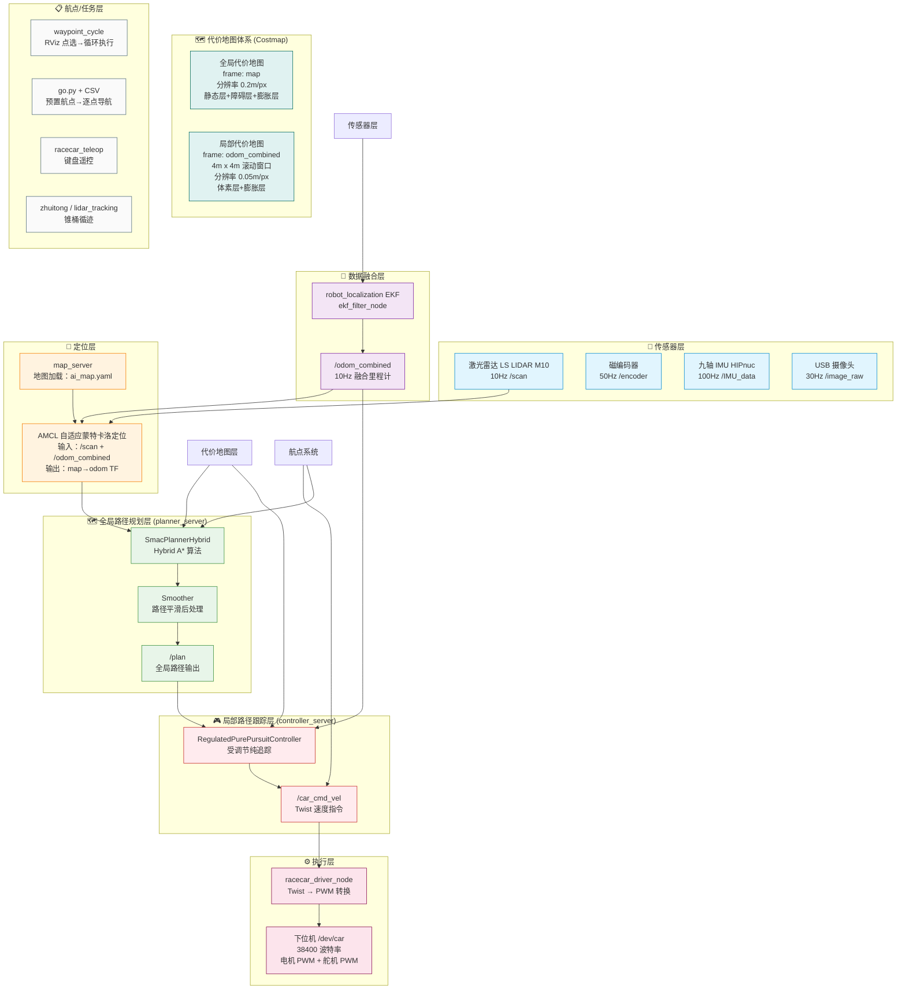
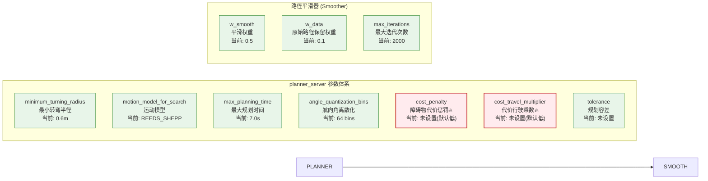
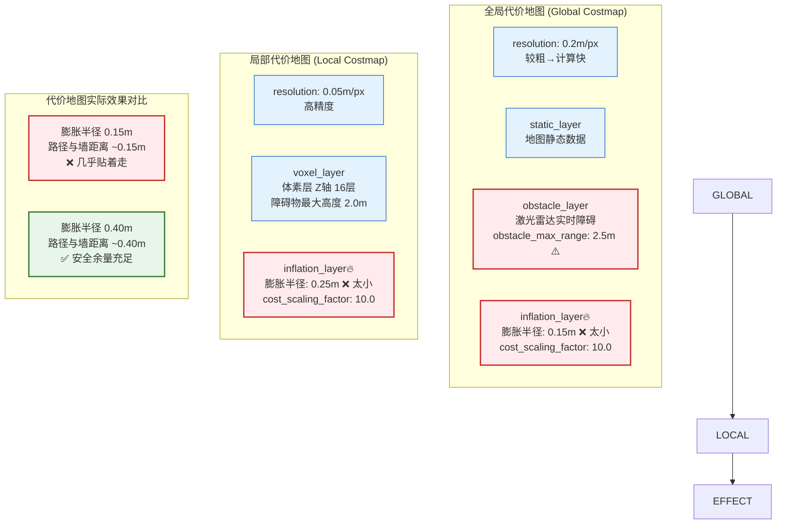
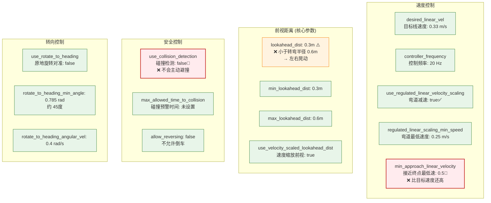
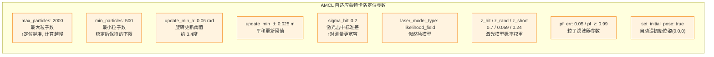
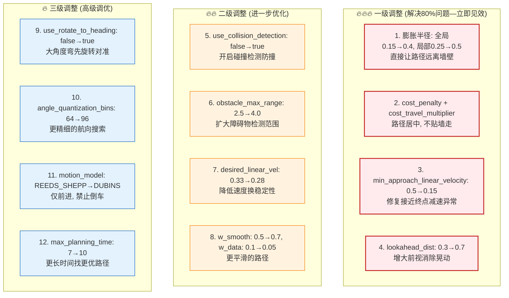

# Nav2 导航调参架构图

> 生成时间：2026-06-07
> 说明：完整展现 Davinci-Mini 小车从传感器→融合→规划→控制的参数全链路

---

## 一、导航全链路架构总览

---

## 二、Planner Server 全局规划参数详解

---

## 三、代价地图参数体系

---

### 四、Controller Server 路径跟踪参数

---

## 五、AMCL 定位参数

---

## 六、当前系统与实际链路对比

```mermaid
graph TB
    subgraph "🔴 当前实际运行链路"
        C1["Nav2 Planner (SMAC)<br/>生成全局路径✅"]
        C2["controller_server<br/>被注释❌"]
        C3["go.py / teleop / zhuitong<br/>Python脚本直发 /car_cmd_vel"]
        C4["racecar_driver_node<br/>PWM → 底盘"]
      
        C1 -.->|路径未使用| C2
        C2 -.-> C3
        C3 --> C4
    end

    subgraph "🟢 预期完整链路"
        E1["Nav2 Planner (SMAC)<br/>生成全局路径"]
        E2["Nav2 Controller<br/>RPP 路径跟踪"]
        E3["car_controller_new<br/>L1 路径跟踪 (预留)"]
        E4["racecar_driver_node<br/>PWM → 底盘"]
      
        E1 --> E2
        E2 --> E3
        E3 --> E4
    end

    classDef active fill:#e8f5e9,stroke:#2e7d32
    classDef inactive fill:#ffebee,stroke:#c62828,stroke-dasharray: 5 5
    classDef bypass fill:#fff3e0,stroke:#f57c00

    class C1 active
    class C2 inactive
    class C3,C4 bypass
    class E1,E2,E3,E4 active
```

---

## 七、参数调整优先级热力图

---

## 八、参数速查表

| 层级 |    模块    |                  参数                  |     当前值     |      建议值      |         作用         |
| :--: | :--------: | :------------------------------------: | :-------------: | :---------------: | :-------------------: |
| 规划 |  Planner  |            `cost_penalty`            |  未设置(默认)  | **2.0~3.0** | ⭐ 路径偏离障碍物意愿 |
| 规划 |  Planner  |       `cost_travel_multiplier`       |  未设置(默认)  | **2.0~3.0** | ⭐ 高成本区域惩罚倍率 |
| 规划 |  Planner  |       `minimum_turning_radius`       |       0.6       |  0.6 (匹配车体)  |     转弯半径约束     |
| 规划 |  Planner  |      `motion_model_for_search`      |   REEDS_SHEPP   |    REEDS_SHEPP    |       运动模型       |
| 规划 |  Smoother  |       `w_smooth` / `w_data`       |    0.5 / 0.1    |    0.7 / 0.05    |  平滑度 vs 原始路径  |
| 地图 |  全局膨胀  |          `inflation_radius`          | **0.15** |   **0.4**   |      🚨 安全余量      |
| 地图 |  局部膨胀  |          `inflation_radius`          | **0.25** |   **0.5**   |      🚨 安全余量      |
| 地图 |   障碍层   |         `obstacle_max_range`         |  **2.5**  |   **4.0**   |       检测范围       |
| 控制 | Controller |           `lookahead_dist`           |  **0.3**  |   **0.7**   |      ⭐ 前视距离      |
| 控制 | Controller |         `desired_linear_vel`         |      0.33      |     0.28~0.33     |       目标速度       |
| 控制 | Controller |    `min_approach_linear_velocity`    |  **0.5**  |  **0.15**  |    🚨 接近终点减速    |
| 控制 | Controller |      `use_collision_detection`      | **false** |  **true**  |      🚨 碰撞检测      |
| 控制 | Controller | `regulated_linear_scaling_min_speed` |      0.25      |       0.15       |      弯道最低速      |
| 控制 | Controller |       `use_rotate_to_heading`       |      false      |       true       |      大弯先旋转      |
| 定位 |    AMCL    | `max_particles` / `min_particles` |    2000/500    |       按需       |       定位精度       |
| 任务 |     BT     |          `goal_reached_tol`          |       0.6       |       按需       |       到达容差       |

---

> **相关文档索引**：
>
> - [知识库/15-导航调参指南.md](../知识库/15-导航调参指南.md) — 晃动/撞墙/犹豫根因分析
> - [知识库/18-nav.yaml配置详解.md](../知识库/18-nav.yaml配置详解.md) — 全参数逐项详解
> - [知识库/09-SLAM与导航.md](../知识库/09-SLAM与导航.md) — SLAM 建图与导航基础
> - [知识库/20-src目录调研.md](../知识库/20-src目录调研.md) — 当前系统状态分析
> - [知识库/21-配置文件有效性调研.md](../知识库/21-配置文件有效性调研.md) — 配置文件引用溯源
