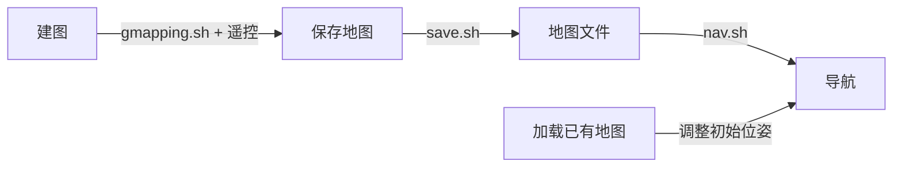

# SLAM 与导航

## 概述

本系统支持两种 SLAM 方法和一套完整的 Nav2 导航系统：

| 功能 | 实现方式 | 启动方式 |
|------|----------|----------|
| **Gmapping SLAM** | slam_gmapping (基于 OpenSLAM) | `bash ~/racecar/gmapping.sh` |
| **Cartographer SLAM**（准备中） | 通过 `carto_slam` 参数启用 EKF 不同模式 | `carto_slam:=true` |
| **AMCL 定位** | nav2_amcl（基于已有地图的定位） | `bash ~/racecar/nav.sh`（自动加载地图） |
| **Nav2 导航** | nav2_stack (规划+控制+导航行为树) | `bash ~/racecar/nav.sh` |
| **航点循环** | nav2_waypoint_cycle | nav.sh 包含 |

---

## 1. Gmapping SLAM 建图

### 启动

```bash
# 终端1：启动底盘+传感器+SLAM
bash ~/racecar/gmapping.sh

# 终端2：启动键盘控制建图
source ~/racecar/install/setup.bash
ros2 run racecar racecar_teleop
```

### 控制机器人建图

1. 建图过程中，打开 RViz 查看（`gmapping.sh` 会自动启动 rviz2）
2. 在 RViz 中添加 `/map` 话题显示
3. 遥控机器人缓慢走遍整个区域（关键：*/scan 与 /odom_combined 的 TF 树必须正确*）
4. 确保回环闭合（走一圈回到起点附近的区域）

### 保存地图

```bash
# 方法1：使用 save.sh（保存到 src/racecar/map/ai_map）
bash ~/racecar/save.sh

# 方法2：手动指定路径
ros2 run nav2_map_server map_saver_cli -f ~/racecar/src/racecar/map/my_map
```

保存后的文件：
- `ai_map.yaml` — 地图元数据（分辨率、原点、阈值）
- `ai_map.pgm` — 灰度图像（黑色=障碍物，白色=自由，灰色=未知）

### 地图文件结构示例

```yaml
image: ai_map.pgm
mode: trinary            # 三值地图（占/自/未）
resolution: 0.05         # 每像素 0.05 米
origin: [-22.8, -10, 0]  # 地图原点（右下角）
negate: 0                # 不翻转像素值
occupied_thresh: 0.65    # >65% 概率视为占用
free_thresh: 0.25        # <25% 概率视为自由
```

---

## 2. Nav2 自主导航

### 前提条件

- 已经有一张建好的地图（`ai_map.yaml`）
- 机器人在地图中的大概位置已知

### 启动导航

```bash
# 完整启动（底盘+传感器+定位+导航）
bash ~/racecar/nav.sh
```

### 导航堆栈组成

```
Nav2 Stack (via bringup_launch.py)
├── AMCL (自适应蒙特卡洛定位)
│   输入: /scan, /odom_combined
│   输出: map→odom_combined TF
│   粒子数: 500~2000
│   模型: DifferentialMotionModel
├── Planner Server (全局路径规划)
│   算法: SmacPlannerHybrid (Hybrid A*)
│   最小转弯半径: 0.6m
│   运动模型: REEDS_SHEPP
├── Controller Server (局部控制)
│   算法: RegulatedPurePursuitController
│   目标速度: 0.33 m/s
│   前视距离: 0.3~0.6m
│   弯道减速: 启用
├── Behavior Server
│   行为: spin, backup, drive_on_heading, wait
│   最大旋转: 1.0 rad/s
├── BT Navigator (行为树导航)
│   全局帧: map
│   机器人帧: base_footprint
│   到达容差: 0.6m
└── Waypoint Follower
    暂停时长: 200ms/点
    失败继续: true
```

### 定位说明

AMCL 参数：
- `global_frame_id: "map"` — 全局定位坐标系
- `odom_frame_id: "odom_combined"` — 里程计坐标系（与 EKF 输出一致）
- `base_frame_id: "base_footprint"` — 机器人底坐标系
- `set_initial_pose: True` — 自动设置初始位姿（0,0,0）

如果需要重新设置初始位姿（当机器人不在原点启动时）：
1. 在 RViz 中使用 "2D Pose Estimate" 按钮
2. 点击机器人在地图上的预估计位置并拖拽方向

或者发布主题：
```bash
ros2 topic pub /initialpose geometry_msgs/PoseWithCovarianceStamped "{header: {frame_id: 'map'}, pose: {pose: {position: {x: 0.0, y: 0.0}, orientation: {z: 0.0, w: 1.0}}}}"
```

### 导航操作

**方法1：RViz 2D Nav Goal**
1. 在 RViz 中点击 "2D Nav Goal" 按钮
2. 点击地图上的目标点并拖拽设置方向
3. 机器人自动规划路径并导航

**方法2：航点循环**
1. 在 RViz 中点击 "Publish Point" 按钮
2. 在地图上点击多个航点（显示为箭头带编号）
3. `waypoint_cycle` 节点自动按顺序导航到每个点
4. 到达所有点后自动从第一个重新开始

**方法3：命令行发布**
```bash
ros2 topic pub /goal_pose geometry_msgs/PoseStamped "{
  header: {frame_id: 'map'},
  pose: {position: {x: 1.0, y: 0.5}, orientation: {z: 0.0, w: 1.0}}
}"
```

---

## 3. 代价地图体系

### 局部代价地图 (local_costmap)

用于实时避障和局部路径规划：
- **坐标系**: odom_combined
- **范围**: 4m × 4m（跟随机器人滚动）
- **分辨率**: 0.05m/像素
- **图层**: 体素层（voxel）+ 膨胀层（inflation）
- **体素层**: 从 /scan 输入，Z 轴 16 个体素（0.05m 分辨率），最大障碍物高度 2m
- **膨胀层**: 膨胀半径 0.25m，成本缩放因子 10.0

### 全局代价地图 (global_costmap)

用于全局路径规划：
- **坐标系**: map
- **分辨率**: 0.2m/像素
- **图层**: 静态层（地图）+ 障碍层 + 膨胀层
- **静态层**: 从已保存的地图加载
- **障碍层**: 从 /scan 实时输入，障碍物检测最大范围 2.5m
- **膨胀层**: 膨胀半径 0.15m，成本缩放因子 10.0

---

## 4. 导航参数调优

### 常见调整项

| 参数 | 位置 | 推荐调整范围 | 说明 |
|------|------|-------------|------|
| `desired_linear_vel` | nav.yaml: controller_server.FollowPath | 0.2~0.5  | 最大线速度 |
| `lookahead_dist` | nav.yaml: controller_server.FollowPath | 0.3~1.0 | 前视距离（越大越平滑，越小越激进）|
| `minimum_turning_radius` | nav.yaml: planner_server.GridBased | 0.4~0.8 | 最小转弯半径（需与机器人匹配）|
| `xy_goal_tolerance` | nav.yaml: controller_server.goal_checker | 0.1~0.6 | 到达目标的位置容差 |
| `inflation_radius` | nav.yaml: */costmap.inflation_layer | 0.1~0.5 | 障碍物膨胀半径（越大离障碍越远）|
| `max_particles`/`min_particles` | nav.yaml: amcl | 500~3000 | AMCL 粒子数（越多越稳但越慢）|

### 导航故障排查

| 症状 | 可能原因 | 解决方法 |
|------|----------|----------|
| 不规划路径 | 地图未加载或 TF 树断裂 | 检查 map_server 日志和 tf 树 |
| 定位漂移 | AMCL 初始位姿不准确 | 使用 2D Pose Estimate 重设 |
| 路径规划失败 | 地图/障碍层不完整 | 检查 costmap 可视化 |
| 急转/不稳 | 前视距离太小 | 增大 lookahead_dist |
| 无法到达终点 | 容差过小或规划参数不当 | 增大 goal_tolerance 或减小 turning_radius |
| 定位丢失（kidnapped） | 粒子收敛到错误位置 | 增大 recovery_alpha 或手动重定位 |

---

## 5. Map → SLAM → Nav 工作流程总结



完整流程：
1. **没有地图时**：运行 `gmapping.sh` → 遥控建图 → `save.sh` 保存
2. **已有地图时**：运行 `nav.sh` → 设置初始位姿（RViz） → 设置目标或航点 → 机器人自主导航
